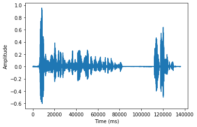
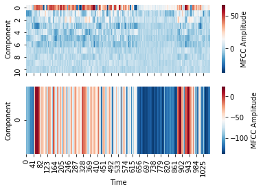

# Data as MFCC
Please refer to the [data manual](data/data.md) for more in detail information on how to load the data.

## Mel-frequency cepstral coefficients
When training automatic speech recognition models, it is uncommon to use the raw audio or waveform as input features. Instead, engineered features called the *mel-frequency cepstral coefficients* or *MFCCs* are used to describe the audio. Below you find some in depth theory behind MFCCs, as well as a short summary justification.

### MFCC Theory 
A common strategy when handling audio or any other kind of signal is to transform it into its component frequencies, using for example the Fourier transform. Any signal $s$ may be decomposed uniquely into waves with given frequencies $\omega$.

$$
\hat s(\omega) = \mathcal{F}(s(t))(\omega)\\
s(t) =  \mathcal{F}^{-1}(\hat s(\omega))(t)
$$

The set of frequencies is called the *spectrum* of frequencies. The *power spectrum* is magnitude of the Fourier transform of the signal, $|\hat s(\omega)|^2$. Whilst it can uniquely determine a signal, it often has limited use, due to noise sensitivity and some frequencies overpowering others.

A *cepstrum* on the other hand, is a log-transformation of the original spectrum, followed by an inverse transform back to the time domain,
$$

C=\left|{\mathcal {F}}^{-1}\left\{\log \left(\left|\hat s(\omega)\right|^{2}\right)\right\}\right|^{2}.
$$

Why is this useful? By taking the logarithm we transform the data to a more normal/Gaussian form, and de-emphasize large values, see its effect on a signal below.


In practice, the Fourier transform is a discrete Fourier transform (DFT), such as short-term FT (STFT), which is applied on overlapping windows of the signal.

In the case of MFCCs, we map the Fourier transformed signal to the *mel scale*, or *mel-frequency cepstrum*. The mel scale is an empirical musical scale where tones are approximately evenly distributed to human ears. The use of the mel scale is entirely empirical, but the effect of this is that speech recognition systems will be less sensitive to tone/pitch for speakers with similar "timbre" (sound character).

$$
m(\omega)=const\cdot\log _{10}\left(1+{\frac {\omega}{700}}\right)
$$

The final twist of the mel-frequency cepstrum is that instead of the inverse Fourier transform, one uses the discrete cosine transform (DCT). This has the benefit of emphasizing low-frequency signals. The so called mel-frequency cepstrum coefficients are formally defined as the amplitudes
$$
\text{MFCC} = \left|{\text{DCT}}\left\{\log \left(\left|\hat s(m)\right|^{2}\right)\right\}\right|^{2}.
$$

Below shows a time signal, a waveform utterance from the LibriSpeech dataset. Observe the long pause towards the end of the signal.




Below you see two figures. The top one gives the MFCCs for the waveform, and the bottom one the total energy of each time window. Since they are of differnt scale it is better to plot them separately. The *component* denotes a mel-frequency bin. 



### Why MFCCs?
In summary, MFCCs is a method of feature extraction using noise-reduction techniques such as log-transformed Fourier transforms, and a frequency scale which is more invariant to pitch. 

MFCCs have received criticisms for having a very arbitrary frequency scale, but in the end they have shown themselves to be empirically very nice to work with.

## Creating MFCCs
The MFCCs may be accessed via a dataset as 
```python
# Either internally in each sample
>> sample.featurize(n_features=n_features)
>> sample.features

# Or equivalently
>> from audio.utils import waveform_to_features
>> waveform_to_features(sample.waveform, n_features)
```
where *n_features* is the desired number of MFCCs to create. The MFCCs and energy may then be plotted using

```python
>> sample.plot(kind="mfcc")
```